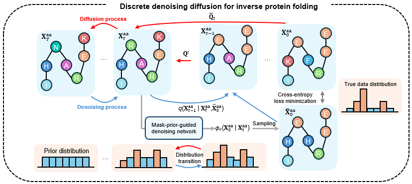

# Mask prior-guided denoising diffusion improves inverse protein folding

<!-- <div align="center"> -->
<a href="https://pytorch.org/get-started/locally/"></a>
<a href="https://hydra.cc/"></a>
[](https://doi.org/10.1038/s42256-025-01042-6)
[](https://github.com/peizhenbai/MapDiff/blob/main/LICENSE)

<!-- </div> -->
## Introduction
This repository contains the PyTorch implementation of the **Ma**sk **p**rior-guided denoising **Diff**usion (**MapDiff**) framework. It is a deep diffusion model with mask prior-guided denoising to improve the inverse protein folding task. It works on 3D protein backbone structures to iteratively predict the feasible 1D sequences of amino acids.

## Framework


## Local Environment Setup
MapDiff is supported to use on Linux, Windows and MacOS (OSX) with enough RAM. We recommand the environment setup via conda package manager. The required python dependencies are given below.
```
# create a new conda environment
$ conda create --name mapdiff python=3.8
$ conda activate mapdiff

# install requried python dependencies
$ conda install pytorch==1.13.1 pytorch-cuda=11.7 -c pytorch -c nvidia
$ conda install pyg==2.4.0 -c pyg
$ conda install -c ostrokach dssp
$ pip install --no-index torch-cluster torch-scatter -f https://pytorch-geometric.com/whl/torch-1.13.0+cu117.html
$ pip install rdkit==2023.3.3
$ pip install hydra-core==1.3.2
$ pip install biopython==1.81
$ pip install einops==0.7.0
$ pip install prettytable
$ pip install comet-ml

# clone the repository of MapDiff
$ git clone https://github.com/peizhenbai/MapDiff.git
$ cd MapDiff
```

## Dataset
**Download the CATH datasets**
- CATH 4.2 dataset is sourced from [Generative Models for Graph-Based Protein Design](https://papers.nips.cc/paper/2019/hash/f3a4ff4839c56a5f460c88cce3666a2b-Abstract.html) [1].
- CATH 4.3 dataset is sourced from [Learning inverse folding from millions of predicted structures](https://proceedings.mlr.press/v162/hsu22a/hsu22a.pdf) [2].

To download the PDB files of CATH, run the following command. `${cath_version}` could be either `4.2` or `4.3`.
```
$ python data/download_cath.py --cath_version=${cath_version}
```
**Process data and construct residue graphs**

Put the downloaded data under the `./data` folder. Then, run the following command to process them. `${download_dir}` is the path to the downloaded data in the previous step.

```
$ python generate_graph_cath.py --download_dir=${download_dir}
```
## Model Training and Inference
We provide the configurations for model hyperparameters in `./conf` via [Hydra](https://github.com/facebookresearch/hydra). The training of MapDiff can be divided into the two stages: mask prior IPA pre-training and denoising diffusion network training. You can directly run the following commands to re-run our training pipeline. `config-name` is the pre-defined yaml file in `./conf`. `${train_data}`, `${val_data}` and `${test_data}` are the paths to the processed data for training and evaluation.

**Mask prior IPA pre-raining**
```
$ python mask_ipa_pretrain.py --config-name=mask_pretrain coemt.use=${use_comet} comet.workspace=${your_workspace} dataset.train_dir=${train_data} dataset.val_dir=${val_data}
```

**Denoising diffusion network training**
```
$ python main.py --config-name=diff_config prior_model.path=${ipa_model} dataset.train_dir=${train_data} dataset.val_dir=${val_data} dataset.test_dir=${test_data}
```

In particular, `${use_comet}` and `${your_workspace}` are optional to use [Comet ML](https://www.comet.com/site/). It is an online machine learning experimentation platform to track and monitor ML experiments. We provide Comet ML support to easily monitor training and evaluation process in our pipeline. Please follow the steps below to apply Comet ML.

- Sign up [Comet](https://www.comet.com/site/) account and install its package via `pip install comet_ml`. 
   
- Save your generated API key into `.comet.config` in your home directory, which can be found in your account setting. The saved file format is as follows:

```
[comet]
api_key=YOUR-API-KEY
```

- In `./config/comet`, please set `comet.use` to `True` and change `comet.workspace` into the one that you created on Comet.

**Model Inference**

We provide the inference code to generate the predicted sequence from arbitrary pbd files using the trained MapDiff model. Please refer `model_inference.ipynb` for the detailed usage. You can download our model checkpoint trained on CATH 4.2 from [here](https://github.com/peizhenbai/MapDiff/releases/download/v1.0.1/mapdiff_weight.pt) for use in the inference pipeline.

## Citation
Please cite our [paper](http://arxiv.org/abs/2412.07815) if you find our work useful in your own research.
```
@article{bai2024mapdiff,
  title={Mask prior-guided denoising diffusion improves inverse protein folding}, 
  author={Peizhen Bai and Filip Miljković and Xianyuan Liu and Leonardo De Maria and Rebecca Croasdale-Wood and Owen Rackham and Haiping Lu},
  journal = {Nature Machine Intelligence},
  year    = {2025},
  publisher={Nature Publishing Group},
  doi     = {0.1038/s42256-025-01042-6}
}
```

## Acknowledgements and References
The code implementation is inspired and partially based on earlier works [3-6]. Thanks for their contributions to the open-source community.

    [1] Ingraham, J., Garg, V., Barzilay, R., & Jaakkola, T. (2019). Generative models for graph-based protein design. Advances in neural information processing systems, 32.
    [2] Hsu, C., Verkuil, R., Liu, J., Lin, Z., Hie, B., Sercu, T., ... & Rives, A. (2022, June). Learning inverse folding from millions of predicted structures. In International conference on machine learning (pp. 8946-8970). PMLR.
    [3] Yi, K., Zhou, B., Shen, Y., Liò, P., & Wang, Y. (2024). Graph denoising diffusion for inverse protein folding. Advances in Neural Information Processing Systems, 36.
    [4] Austin, J., Johnson, D. D., Ho, J., Tarlow, D., & Van Den Berg, R. (2021). Structured denoising diffusion models in discrete state-spaces. Advances in Neural Information Processing Systems, 34, 17981-17993.
    [5] Akpinaroglu, D., Seki, K., Guo, A., Zhu, E., Kelly, M. J., & Kortemme, T. (2023). Structure-conditioned masked language models for protein sequence design generalize beyond the native sequence space. bioRxiv, 2023-12.
    [6] Ahdritz, G., Bouatta, N., Floristean, C., Kadyan, S., Xia, Q., Gerecke, W., ... & AlQuraishi, M. (2024). OpenFold: Retraining AlphaFold2 yields new insights into its learning mechanisms and capacity for generalization. Nature Methods, 1-11.
